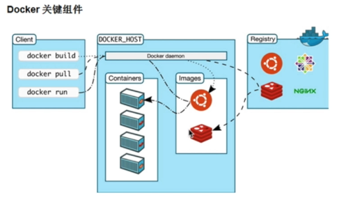

## 1. 容器和Docker

### 1.1 什么是容器化？

### 1.2 什么是Docker

### 1.3 Docker vs 虚拟机

### 1.4 Docker的工作原理（重点）



Docker是容器化部署技术，它主要作用是在于通过运行容器来实现应用部署，而容器基于镜像运行。

简单的说，就是将你的项目和依赖包（基础镜像）打成一个带有启动指令的项目镜像，然后在服务器创建一个容器，让镜像在容器内运行，从而实现项目的部署。

服务器就是容器的宿主机，docker容器与宿主机之间是互相隔离的。

Docker 的基础是 Linux容器（LXC：Linux Containers）等技术。

**一般情况下：**

Linux（服务器） ==> tomcat安装 ==> java依赖 ==> maven依赖 ==> 放置在 /usr/lib目录 ==> 配置 tomcat端口/目录 ==> 运行tomcat中的 startup.sh 脚本 ==> 配置网络、防火墙等（后续）===> 服务启动

**Docker：**

使用基于java的tomcat镜像 ==> docker run ==> 指定端口/挂载webapp目录 ==> 服务启动

这其中，发生了什么？

1. Docker会自己拉取镜像，若本地已经存在该镜像，则不用到网上去拉取
2. 创建新的容器
3. 分配文件系统并且挂着一个可读写的层，任何修改容器的操作都会被记录在这个读写层上，你可以保持这些修改成你的镜像，也可以选择不保存，那么下次运行该镜像的时候所有修改操作都会被消除
4. 分配网络/桥接接口，创建一个允许容器与本地主机通信的网络接口
5. 设置ip地址，从池中寻找一个可用的ip地址附加到容器上，换句话说，localhost并態访问到容器
6. 运行你指定的程序
7. 捕获并且提供应用输出，包括输入、输出、报错信息


Docker的价值：

从应用架构角度：统一复杂的构建环境

从应用部署角度：解决依赖不同、构建麻烦的问题，结合自动化工具（如jenkins）提高效率。

从集群管理角度：规范的服务调整，服务发现，负载均衡

## 2. 场景的引用场景介绍

docker提供了轻量级的虚拟化，相对于虚拟机，可以在同一台机器上创建更多数量的容器。它场景的应用场景：1. 快速部署；2. 隔离应用； 3. 提高开发效率； 4. 版本控制； 5. 简化配置，整合资源；

### 2.1 快速部署

我们尝试着来部署一个mysql:

```
docker run -d --name mysql-test -e MYSQL_ROOT_PASSWORD=123456 mysql

// 启动一个mysql服务
docker run -itd --name mysql1 -e MYSQL_ROOT_PASSWORD=123456 -p 8100:3306 mysql

// 
docker ps

docker logs mysql1
// 进入mysql服务
docker exec -it mysql1 /bin/bash
```

### 2.2 隔离应用

我们可以同时跑两个mysql，两个Nginx，指定不同的端口进行映射：

把 ` mysql-test ` 映射到`8001`端口，把 `mysql-test2` 映射到`8002`端口。

```js
docker run -d --name mysql-test1 -p 8001:3306 -e MYSQL_ROOT_PASSWORD=123456 mysql
docker run -d --name mysql-test2 -p 8002:3306 -e MYSQL_ROOT_PASSWORD=123456 mysql
```

把web1映射到8100端口，把web2映射到8200端口。

```js
docker run -d --name web1 -p 8100:80 -v $(your_dir):/usr/share/nginx/html nginx
docker run -d --name web2 -p 8200:80 -v $(your_dir):/usr/share/nginx/html nginx
```


### 2.3 提高开发效率

1. 一致的运行环境

   由于Docker确保了执行环境的一致性，使得应用的迁移更加容易。Docker可以在很多平台上运行，无论是物理机、虚拟机、共有云、私有云，甚至是笔记本，其运行结果是一致的。因此用户可以很轻易的将一根平台上运行的应用，迁移到另一个平台上，而不用担心运行环境的变化导致应用无法正常运行的情况。

2. 更快速的启动时间

   传统的虚拟机技术启动应用服务往往需要数分钟，而Docker容器应用，由于直接运行于宿主内核，无需启动完整的操作系统，因此可以做到秒级、甚至毫秒级的启动时间。大大的节约了开发、测试、部署的时间。

3. 更高效的复用系统资源

   由于容器不需要进行硬件虚拟以及运行完整操作系统等额外开销，Docker对系统资源的利用率更高。无论是应用执行速度、内存损耗或者文件存储速度，都要比传统虚拟机技术更高效。因此，相比虚拟机技术，一个相同配置的主机，往往可以运行更多数量的应用。

4. 仓库/镜像机制

   使用仓库可以方便的在任何有docker进程的虚拟机/服务器/主机上运行docker应用，环境的统一，让它们的部署变的非常的简单。

### 2.4 版本控制

Docker容器还可以像git仓库一样，可以让你提交变更到Docker镜像中并通过不同的版本来管理它们，来看看下面的例子：

我们之前创建了一个	`mysql`，现在，我们使用`commit`命令就可以给它做一个快照，打上一个 `tag`

```js
$ docker ps
CONTAINER ID        IMAGE               COMMAND                  CREATED             STATUS              PORTS                               NAMES
64333602fc62        mysql               "docker-entrypoint.s…"   19 minutes ago      Up 19 minutes       33060/tcp, 0.0.0.0:8101->3306/tcp   mysql2
cc06af7dd48c        mysql               "docker-entrypoint.s…"   9 hours ago         Up 44 minutes       33060/tcp, 0.0.0.0:8100->3306/tcp   mysql1
// 
$ docker commit 64333602fc62   mysql:1.0

// 查看 docker镜像
$ docker images

$ docker run -itd --name mysql2-dev -p 8102:3306 mysql:1.0

$ docker ps
```

### 2.5 DevOps流程

对开发和运维（DevOps）人员来说，最希望的就是一次创建或配置，可以在任意地方正常运行。

使用Docker可以通过订制应用镜像来实现持续集成、持续交付、部署。开发人员可以通过 Dockerfile 来进行镜像构建，并结合 持续集成（Continuous Integration）系统进行集成测试，而运维人员则可以直接在生产环境中快速部署该镜像，甚至结合 持续部署（Continuous Delivery/Deployment）系统进行自动部署。

而且使用`Dockerfile`使镜像构建透明化，不仅仅开发团队可以理解应用运行环境，也方便运维团队理解应用所需条件，帮助更好的生产环境中部署该镜像。


## 3. 使用Docker

### 3.1 Docker如何进行安装

### 3.1.1 关系系统需求（重点）

## 3.4 Docker常见命令（重点）

- 创建`run` 

  - -p 隐射宿主机的端口给镜像服务使用 prot

  - -v 挂载宿主机的文件目录到镜像里面去

  - -it 是提供交互式的终端工具  i=interactive（交互） t=terminal（终端）

  - -d 是让镜像容器在后台去持续运行

  - exec 可以进入到容器里面去

    ```
    docker exec -it <container_name> /bin/bash
    docker exec -it <container_name> /bin/sh
    ```

  - --name 指定容器的名称

- 启动`start` / 停止`stop`  / 重启`restart` / 删除已停止容器 `rm`

- 登录仓库 `login` / 拉取镜像 `pull` / 推送 `push` / 提交镜像 `commit` / 给指定容器标签 `tag`

  Docker hub 上去注册我们的账号，才能使用login

  ```
  docker commit <container_id> <namespace>/<image_name>:tag
  ```

  如：

  ```
  docker commit e12b80defe8c itcast/mysql1
  ```

  ```
  docker pull/push <namespace>/<image_name>:tag
  ```

  

- 查看所有本地镜像 `images` / 删除本地镜像 `rmi`

  删除镜像前，要停止`stop`并且删除`rm`运行中的容器。

- 查看容器服务打印的日志`logs` / 检阅容器 `inspect` (更详细的容器信息，硬件/网络/版本等) / 进入容器 `exec`

- 查看版本 `version` / docker 进程信息 `info`

# 4. 扩展知识

## 4.1 制作 Docker

Dockerfile 是一个由一堆命令 + 参数构成的脚本，使用`docker build` 即可执行脚本构建镜像，自动的去做一些事，主要用于进行持续集成。

一般，Dockerfile 共包括四部分：

- 基础镜像信息
- 维护者信息
- 镜像操作指令
- 容器启动时执行指令


当Node.js 遇到 Docker，下面介绍 Docker在前端中的应用：

一个简单的Koa应用：

```js
const Koa = require('koa');
const app = new Koa();

// response
app.use(ctx => {
	ctx.body = 'hello Koa!!'
});

app.listen(3000);
```


Dockerfile示例：

```dockerfile
FROM node:10

LABEL maintainer=itheima@itcast.cn

# 创建 app 目录
WORKDIR /app

# 把 package.json, package-lock.json(npm@5+) 或 yarn.lock 复制到工作目录（相对路径）
COPY ["package.json", "*.lock", "./"]

# 打包 app 源码
# 特别注意：要指定工作目录中的文件名
COPY src ./src

# 使用.dockerignore文件，上面两个COPY合并成一个
# COPY . .

# 使用Yarn安装 app 依赖
# 如果你需要构建生成环境下的代码，请使用：
# --prod参数
RUN yarn --prod --registry=https://registry.npm.taobao.org

# 对外暴露端口
EXPOSE 3000

CMD ["node", "src/index.js"]
```

使用`docker build`打包：

```shell
docker build -t ${your_name}/${image_name}:${tag} .
```

